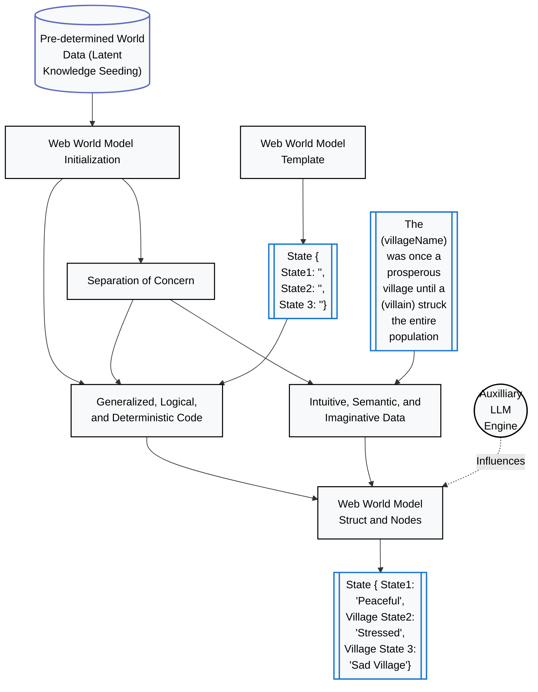
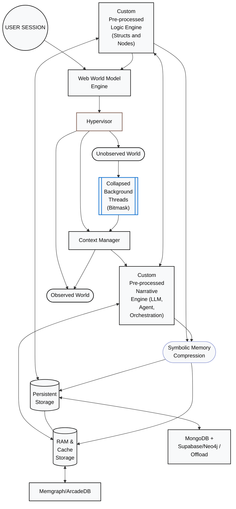

* Transparency: These are AI-generated diagrams in mermaidJS, however for the lucidchart version made by me, you may refer to /assets/

## PRE-PROCESSING ARCHITECTURE

```mermaid
graph TD
    classDef default fill:#f8f9fa,stroke:black,stroke-width:1.5px,color:black;
    classDef database fill:#f8f9fa,stroke:#5c6bc0,stroke-width:2px,color:black;
    classDef stateDoc fill:#f8f9fa,stroke:#1976d2,stroke-width:2px,color:black;
    classDef engine fill:#f8f9fa,stroke:black,stroke-width:2px,color:black;

    A[("Pre-determined World<br/>Data (Latent<br/>Knowledge Seeding)")]:::database
    B["Web World Model Initialization"]:::default
    C["Separation of Concern"]:::default
    D["Generalized, Logical,<br/>and Deterministic Code"]:::default
    E["Intuitive, Semantic, and<br/>Imaginative Data"]:::default
    F["Web World Model<br/>Template"]:::default
    
    G[["State {<br/>State1: '',<br/>State2: '',<br/>State 3: ''}"]]:::stateDoc
    H[["The<br/>(villageName)<br/>was once a<br/>prosperous<br/>village until a<br/>(villain) struck<br/>the entire<br/>population"]]:::stateDoc
    I["Web World Model<br/>Struct and Nodes"]:::default
    J(("Auxilliary<br/>LLM<br/>Engine")):::engine
    K[["State { State1:<br/>'Peaceful',<br/>Village State2:<br/>'Stressed',<br/>Village State 3:<br/>'Sad Village'}"]]:::stateDoc

    A --> B
    
    B --> C
    B --> D
    
    C --> D
    C --> E
    
    F --> G
    G --> D
    
    H --> E
    
    D --> I
    E --> I
    
    J -. "Influences" .-> I
    
    I --> K

    linkStyle default color:black;

```

## REAL-TIME ARCHITECTURE

```mermaid
graph TD
    %% Styling classes to match the image and force black text
    classDef default fill:#f8f9fa,stroke:black,stroke-width:1.5px,color:black;
    classDef database fill:#f8f9fa,stroke:black,stroke-width:1.5px,color:black;
    classDef stateDoc fill:#f8f9fa,stroke:#1976d2,stroke-width:2px,color:black;
    classDef cloudNode fill:#f8f9fa,stroke:#9fa8da,stroke-width:1.5px,color:black;
    classDef hypervisor fill:#f8f9fa,stroke:#8d6e63,stroke-width:2px,color:black;

    %% Node Definitions
    U((USER SESSION)):::default
    W["Web World Model<br/>Engine"]:::default
    H["Hypervisor"]:::hypervisor
    
    LE["Custom<br/>Pre-processed<br/>Logic Engine<br/>(Structs and<br/>Nodes)"]:::default
    NE["Custom<br/>Pre-processed<br/>Narrative<br/>Engine (LLM,<br/>Agent,<br/>Orchestration)"]:::default
    
    PS[("Persistent<br/>Storage")]:::database
    RC[("RAM &<br/>Cache<br/>Storage")]:::database
    
    MDB["MongoDB +<br/>Supabase/Neo4j /<br/>Offload"]:::default
    MG["Memgraph/ArcadeDB"]:::default
    
    %% Using a stadium/pill shape to represent the cloud for maximum parser compatibility
    SMC(["Symbolic Memory<br/>Compression"]):::cloudNode
    
    UW(["Unobserved World"]):::default
    OW(["Observed World"]):::default
    
    C[["Collapsed<br/>Background<br/>Threads<br/>(Bitmask)"]]:::stateDoc
    CM["Context Manager"]:::default

    %% Edge Connections
    U --> W
    W --> H
    
    H --> UW
    H --> OW
    H --> CM
    
    UW --> C
    C --> CM
    CM --> OW
    CM --> NE
    
    LE --> W
    
    %% Bidirectional mappings for logic/narrative and storage
    LE <--> PS
    LE <--> NE
    NE <--> RC
    
    %% External database offloads
    PS <--> MDB
    RC <--> MG
    
    %% Persistent and Cache interconnect (straight line)
    PS --- RC
    
    %% Symbolic Memory Compression mappings
    LE --> SMC
    NE --> SMC
    SMC --> PS
    SMC --> RC

    %% Force any implicit link text to black
    linkStyle default color:black;
```
