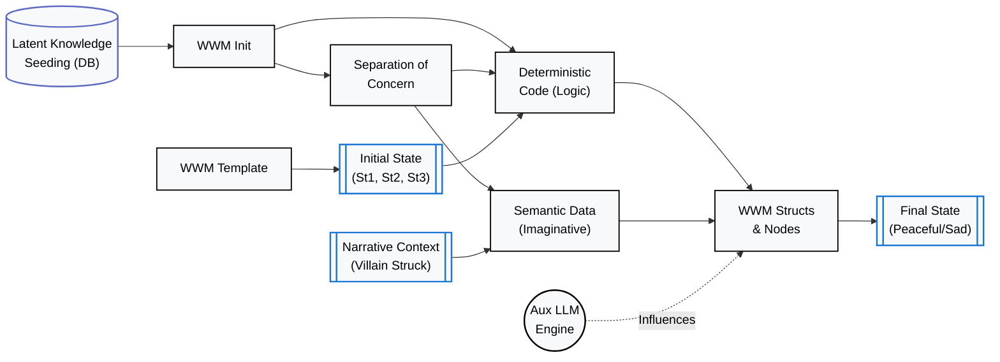
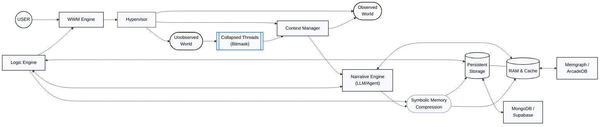
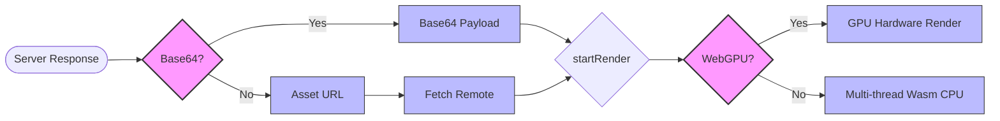

## PRE-PROCESSING ARCHITECTURE

```mermaid
graph LR
classDef default fill:#f8f9fa,stroke:black,stroke-width:1.5px,color:black;
classDef db fill:#f8f9fa,stroke:#5c6bc0,stroke-width:2px,color:black;
classDef doc fill:#f8f9fa,stroke:#1976d2,stroke-width:2px,color:black;
classDef eng fill:#f8f9fa,stroke:black,stroke-width:2px,color:black;

A[("Latent Knowledge<br/>Seeding (DB)")]:::db
B["WWM Init"]:::default
C["Separation of<br/>Concern"]:::default
D["Deterministic<br/>Code (Logic)"]:::default
E["Semantic Data<br/>(Imaginative)"]:::default
F["WWM Template"]:::default
G[["Initial State<br/>(St1, St2, St3)"]]:::doc
H[["Narrative Context<br/>(Villain Struck)"]]:::doc
I["WWM Structs<br/>& Nodes"]:::default
J(("Aux LLM<br/>Engine")):::eng
K[["Final State<br/>(Peaceful/Sad)"]]:::doc

A --> B --> C & D
C --> D & E
F --> G --> D
H --> E
D & E --> I
J -. Influences .-> I --> K
linkStyle default color:black;
```

## REAL-TIME ARCHITECTURE

```mermaid
graph LR
classDef default fill:#f8f9fa,stroke:black,stroke-width:1.5px,color:black;
classDef db fill:#f8f9fa,stroke:black,stroke-width:1.5px,color:black;
classDef doc fill:#f8f9fa,stroke:#1976d2,stroke-width:2px,color:black;
classDef cloud fill:#f8f9fa,stroke:#9fa8da,stroke-width:1.5px,color:black;
classDef hyper fill:#f8f9fa,stroke:#8d6e63,stroke-width:2px,color:black;

U((USER)):::default --> W["WWM Engine"]:::default
LE["Logic Engine"]:::default --> W
W --> H["Hypervisor"]:::hyper
H --> UW(["Unobserved<br/>World"]):::default
H --> OW(["Observed<br/>World"]):::default
H --> CM["Context Manager"]:::default

UW --> C[["Collapsed Threads<br/>(Bitmask)"]]:::doc --> CM
CM --> OW
CM --> NE["Narrative Engine<br/>(LLM/Agent)"]:::default

LE <--> PS[("Persistent<br/>Storage")]:::db
LE <--> NE
NE <--> RC[("RAM & Cache")]:::db
PS <--> MDB["MongoDB /<br/>Supabase"]:::default
RC <--> MG["Memgraph /<br/>ArcadeDB"]:::default
PS --- RC

LE & NE --> SMC(["Symbolic Memory<br/>Compression"]):::cloud
SMC --> PS & RC
linkStyle default color:black;
```

## RENDER PIPELINE

```mermaid
graph LR
A([Server Response]) --> B{Base64?}
B -- Yes --> C[Base64 Payload]
B -- No --> D[Asset URL] --> E[Fetch Remote]
C & E --> F{startRender}
F --> G{WebGPU?}
G -- Yes --> H[GPU Hardware Render]
G -- No --> I[Multi-thread Wasm CPU]

classDef decision fill:#f9f,stroke:#333,stroke-width:2px;
classDef process fill:#bbf,stroke:#333,stroke-width:1px;
class B,G decision; class C,D,E,H,I process;
```
