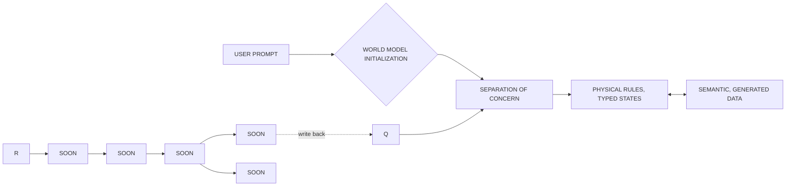

# IMMERSIA

# ARCHITECTURE

```mermaid
flowchart LR
    U[USER PROMPT] --> C{WORLD MODEL INITIALIZATION}
    C --> E[SEPARATION OF CONCERN]
    E --> A[PHYSICAL RULES, TYPED STATES] <--> B[SEMANTIC, GENERATED DATA]
    Q --> E
    R --> P[SOON]
    P --> L[SOON]
    L --> O[SOON]
    O --> M[SOON]
    O --> T[SOON]
    M -.write back.-> Q
```
